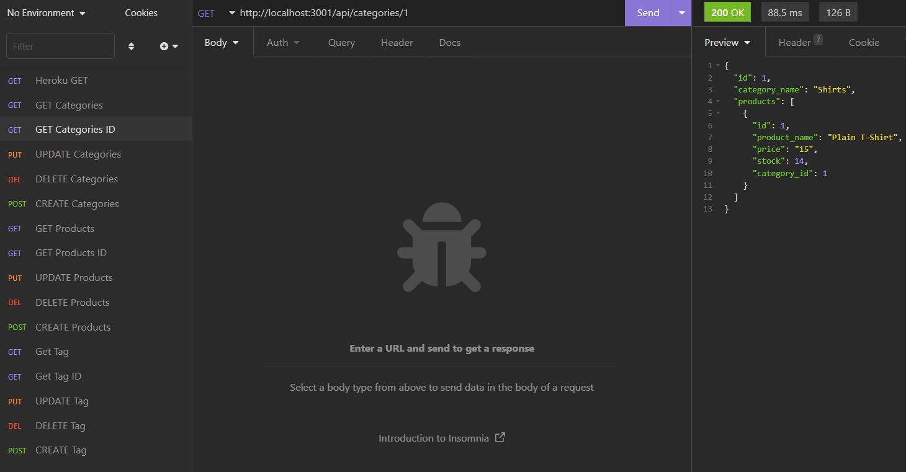

# E-Commerce Back End

An app that interacts with [Insomnia](https://insomnia.rest/download) for `GET`, `PUT`, `DELETE` and `POST` requests.

## Installation

1. Download or Clone this repository.
2. **Node.js**, **Insomnia**, and **MYSQL Workbench** is required to test this application.
3. `npm install` in terminal to install all required dependencies.

## Usage

* Make sure to run `npm run seed` to seed the database.
* Then use `npm run watch` to start the server using nodemon.
* Open **Insomnia** 
* Routes to use: `http://localhost:3001/api/categories`, `/api/products`, `/api/tags`.
* You can make it look like this: 

* [Video Demo](https://www.joemama.com)
                

## Features

* Javascript
* mySQL2
* npm
* .env
* Insomnia

## License

Copyright (c) BoiledLettuce. All rights reserved.